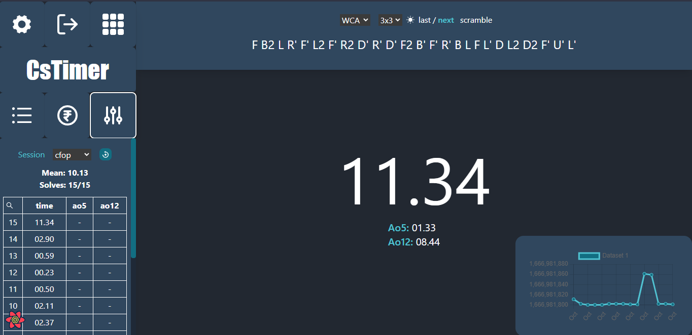

# ⌚ CsTimer

> Professional Rubik's Cube Speedsolving/Training Timer

Cstimer is a rubik's cube timer web application it can calculate mean, averages, create sessions as well as show graphs for analytics.It have support for various puzzles like 2x2, 3x3, 4x4, 5x5, 6x6 and 7x7.



## 🪶 Features covered

-   📱 supports multiple puzzles like 2x2, 3x3 upto 7x7.
-   📈 displays charts to show improvement over time.
-   ✒️ create sessions to organize your solves.
-   🧠 generates random scrambles with my own unique algorithm.
-   ✅ OK / 2️⃣ +2 / ❌ DNF solves
-   🖋️ calculates mean, averages of 5, 12 and over all mean and average of the session
-   🔒 authentication support

## ⚙️ Technologies used

-   🌐 Frontend

    -   ⏭️ Next Js
    -   📨 Axios
    -   📈 Chart Js
    -   📅 Day Js
    -   🔠 Formik
    -   🌏 Zustand
    -   🎨 Sass
    -   🪣 Tailwindcss
    -   🧠 Headless UI
    -   🧯 React Query
    -   💥 Framer motion
    -   🧊 Typescript

-   🛜 Backend
    -   📌 Nest Js
    -   📨 Rest API
    -   📗 Prisma ORM
    -   🐘 PostgresSQL
    -   #️⃣ Argon2
    -   🚇 Redis
    -   ✒️ Sessions
    -   📫 Node mailer
    -   ⚙️ Dotenv - Supports environment variables
    -   🦋 Prettier - Opinionated Code Formatter

## 🚶🏻‍♂️ Getting started

```bash
# 1. Clone the repository
$ git clone https://github.com/naman22a/cstimer

# 2. Enter your newly-cloned folder.
$ cd cstimer

# 3. Create Environment variables file.
$ cp .env.sample .env

# 4. Install dependencies (preferred: yarn)
$ yarn install
```

## 🏃🏻‍♂️ Running the app

```bash
# development
$ yarn run dev

# build
$ yarn build

# production
$ yarn run start
```

## 📫 Stay in touch

-   Author - [Naman Arora](https://namanarora.vercel.app)
-   Twitter - [@namanarora1022](https://twitter.com/namanarora1022)

## 🗒️ License

CsTimer is [MIT LICENSED](./LICENSE)
